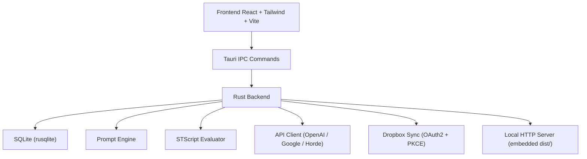

**TavernRev — Complete Project Documentation**  
**Version:** 0.8.0 (27.02.2026)  
**Repository:** (internal — Rust + Tauri desktop app)  
**License:** AGPL v3

---

### 1. Overview

**TavernRev** is a **lightweight, privacy-first, fully offline-capable** AI role-playing chat client inspired by SillyTavern but rebuilt from the ground up in **Rust + Tauri + React + TypeScript**.

**Core philosophy:**
- Maximum control over the prompt (exact SillyTavern-style prompt engineering)
- Full scriptability via **STScript** (macros + conditionals + DB ops)
- Zero telemetry, everything stored locally in SQLite
- Dropbox sync (characters + full chat history with UUID integrity)
- Beautiful modern UI with image support, swipes, branching, regex, lorebooks, etc.

---

### 2. High-Level Architecture



**Key crates / modules:**

| Module              | Purpose |
|---------------------|--------|
| `database.rs`       | All SQLite tables + CRUD + triggers |
| `prompt_engine.rs`  | Full prompt assembly, lore scanning, token budgeting |
| `script_engine/`    | STScript parser + evaluator + commands |
| `api_client.rs`     | Generation for every backend |
| `sync_manager.rs`   | Dropbox OAuth2 + file sync |
| `server.rs`         | Embedded Axum server (web UI fallback) |
| `transformers.rs`   | Role merging / strict alternation |

---

### 3. Database (SQLite)

**File:** `tavern.db` in app data directory

#### Tables

| Table                  | Purpose |
|------------------------|--------|
| `characters`           | Full V2 cards + UUID + timestamps |
| `user_personas`        | Multiple "You" personas (default supported) |
| `chats`                | Chat metadata + UUID + linked persona |
| `messages`             | Full swipe history (`swipes` JSON), images JSON |
| `chat_variables`       | Per-chat `{{var}}` |
| `global_variables`     | Global `{{var}}` |
| `lorebooks`            | Books (global flag) |
| `lore_entries`         | Keys, content, priority, probability, position, depth, constant |
| `chat_lorebooks` / `character_lorebooks` | Many-to-many links |
| `regex_scripts`        | Post-processing rules |
| `quick_replies`        | Global or per-chat buttons |

**Triggers** automatically keep `updated_at` and sync chat timestamps on message changes.

**UUIDs** are used for Dropbox sync (never change on import).

---

### 4. STScript (Macro + Command System)

**Syntax:** `{{macro::arg1::arg2}}` or `/command arg`

#### Core Features

- **Nested execution** (full recursion)
- **Variables** (`setvar`, `getvar`, `addvar`, `incvar`, `flushvar`, global variants)
- **Math**: `add`, `sub`, `mul`, `div`, `roll:3d20+5`
- **Logic**: `gt`, `lt`, `gte`, `lte`, `not`, `or`, `and`, `/if ... | /else | /endif`
- **Random**: `random::option1::option2`
- **Time/Date**
- **Commands** (executed in input):
  - `/echo`, `/sys`, `/user`, `/char`
  - `/setvar`, `/setglobalvar`
  - `/send` → triggers generation
  - `/toast`, `/bg`, `/popup`, `/bubbles`
  - `/enableentry 42`, `/lorebook MyBook`
- **Side effects** stored as `DbOp` and applied atomically after execution

**Placement in pipeline:**
1. Input processing (user message)
2. Lore scanning (can trigger macros)
3. Prompt assembly
4. AI response → regex scripts (`ai` placement)
5. Output display

---

### 5. Prompt Engineering

#### 5.1 PromptModules

Every prompt piece is a **PromptModule** with:
- `identifier` (main, charDescription, worldInfo, etc.)
- `injection_order`
- `injection_depth` (for in-chat injection)
- `injection_position` (0 = relative, 1 = in-chat)
- `role` (system/user/assistant)
- `enabled`, `forbid_overrides`, `injection_trigger`

#### 5.2 Lore / World Info Engine (`scan_lore`)

**Algorithm:**

1. Build scan text (names + description + scenario + last N messages)
2. **Recursive keyword scan** (depth = `wi_max_recursion`)
3. Probability roll per entry
4. **Constant entries** always trigger
5. Triggered entries can contain macros → new text is scanned in next depth
6. **Budgeting**:
   - Fixed token budget (`wi_token_budget`)
   - Or % of context (`wi_context_percent`)
   - Uses `cl100k_base` tokenizer
7. **Sorting strategies**:
   - `char_first` (default)
   - `global_first`
   - `priority`

**Positions supported:**
- `before_char`, `after_char`
- `before_em`, `after_em` (example messages)
- `before_an`, `after_an` (author note)
- `at_depth`, `at_depth_user`, `at_depth_assistant`
- `outlet` (executes macros but adds nothing)

#### 5.3 Transformers

- `merge_consecutive_roles`
- `enforce_alternating_roles` (SillyTavern "strict" mode)

#### 5.4 Visual Identity

- Character & user avatar injection as multimodal messages (OpenAI vision / Google inlineData)
- Configurable prompts per avatar

---

### 6. Generation Pipeline (`perform_generation`)

1. Load profile + preset
2. Load character, history, variables, active lore
3. Assemble prompt (`assemble_prompt`)
4. Apply visual avatars if enabled
5. Save updated variables
6. Add assistant prefill
7. Call correct API (`generate_google`, `generate_horde`, or OpenAI-compatible `generate_stream`)
8. **Regex post-processing** on AI output (`ai` placement)
9. Save final message + new variables

**Supported backends:**
- Any OpenAI-compatible (`/chat/completions`)
- Google Gemini (with thinking config + inline images)
- Stable Horde (async polling)

---

### 7. Dropbox Synchronization

**Flow:**

1. **OAuth2 with PKCE** (no secret needed)
2. **Characters** → `/characters/{uuid}.json`
3. **Avatars** → `/avatars/{filename}`
4. **Chats** → `/chats/{uuid}.jsonl` (header + one JSON per message)

**Push algorithm:**
- Upload every character + avatar
- Upload every chat as fresh JSONL

**Pull algorithm:**
- For each remote character → find by UUID → update or create
- For each remote chat → find by UUID → **delete old messages** → import new JSONL (preserves UUID)

**Conflict resolution:** UUID-based (last write wins on push/pull)

---

### 8. UI/UX Capabilities

#### Core Chat Features
- **Swipes** (multiple generations per message, left/right navigation)
- **Branching** (`/branch` or button)
- **Continue** any message
- **Regenerate** from any point
- **Edit message** (updates swipe history)
- **Delete single swipe / entire message / branch**

#### Visuals
- **Markdown + KaTeX** (full math support)
- **Remote images** via any URL (Catbox, imgur, etc.) — auto-rendered
- **Local image upload** (drag & drop + paste supported)
- **Avatar zoom** on click
- **Bubbles vs Document** layout toggle
- **Content scale** slider
- **Custom CSS** possible via future extensions

#### Advanced Editors
- Full **Character Editor** (V2 spec + alternate greetings)
- **Persona Manager** (multiple "You")
- **Lorebook Editor** (per-chat / per-char / global links, constant entries, probability, depth, positions)
- **Regex Script Editor** (user/ai/both placement)
- **Quick Reply** buttons (global or per-chat)

#### Quality of Life
- Token counter + visual tokenizer
- Macro playground (live testing)
- Toast notifications, popups from scripts
- Mobile-optimized (safe-area, touch gestures)
- Stats modal (messages + token breakdown)

---

### 9. File System Layout (App Data)

```
tavern/
├── tavern.db
├── avatars/
├── presets/*.json
├── connections/*.json
└── (Dropbox sync folder mirrored via API)
```

---

### 10. Extensibility

- Full Tauri command surface (can be called from web UI or external tools)
- All data exportable (JSON/JSONL)
- Regex + STScript = infinite automation possibilities
